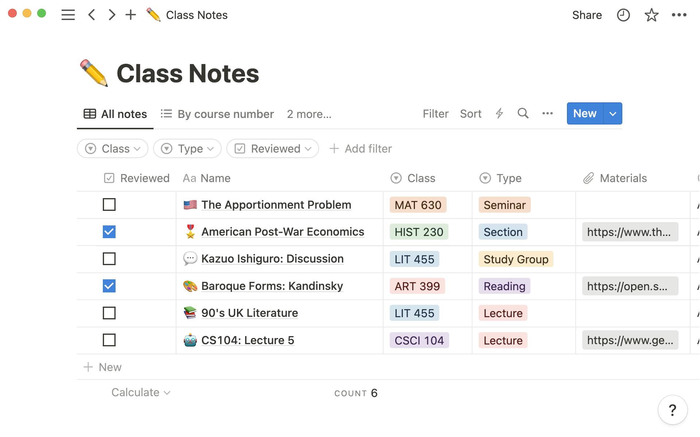
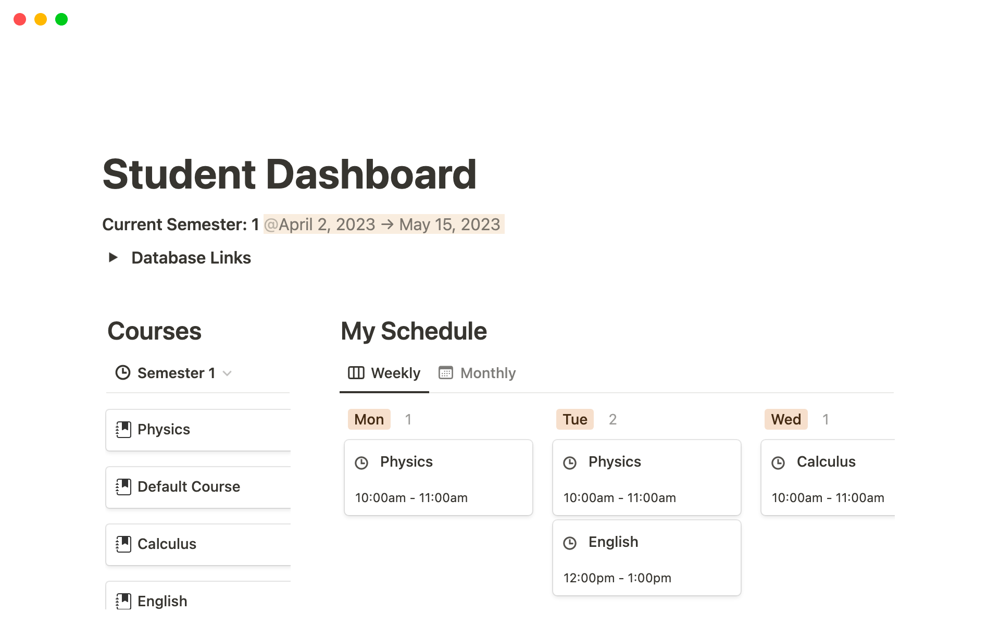

<ins> Market Research: Notion </ins>  

Notion was founded in 2013, it is a productivity software developed by Notion Labs Inc. and launched in 2016. It’s a single space where users can write, plan, manage projects, and customize their space with Notion’s built-in features such as text styling, markdown, font and sizing, page width, and many more. According to Simple.ink, Notion had over 30 million users in 2023. Notion’s core functionalities include note-taking, project management, collaboration tools, and database management. A feature that sets Notion apart from its competitors is flexibility, which allows users to customize their workspace based on their needs using Notion’s built-in features.    

There are a few disadvantages of Notion. Its mobile app does not have the functionalities that the desktop version offers and due to Notion’s customization tools, it is overwhelming to use, and it takes time to get used to Notion.    

 
Individuals and small groups tend to use Notion’s free version and bigger groups or large organizations that need additional features and tools use Notion Plus, which is $8 per month for each user, Notion Business, $15 per month for each user, and Notion Enterprise, which organizations need to contact Notion to get a quote.    

Resource: https://www.simple.ink/blog/notion-stats    
Notion website: https://www.notion.so/product

Screenshots of Notion pages:   

