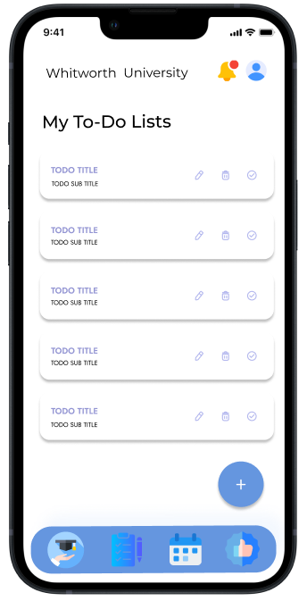
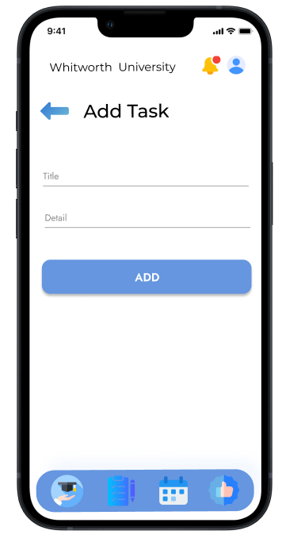

CS375-1 APP1: User Interface Design
====================================

# Instructions:
* Each group must create screen mock-ups drawings for all the features described in the functional specification.
* Include each major screen that the app will display
* e.g. Splash screen, settings screen, data screen, etc...
* Above each screen describe the purpose of that screen and how the user will interact with it.
* Read about the principles of Material design https://material.io/design/ when designing your interface. You don't have to have a perfect first interface design, but head in the right direction!

## Mock Up Design for Student Companion App

Link to Figma Prototype: https://www.figma.com/proto/UQjFS8kcViiM8KkOnEHaiQ/CS375_StudentCompanion?type=design&node-id=1-3&t=mLHTG3kqlc8ygGtR-1&scaling=scale-down&page-id=0%3A1&starting-point-node-id=1%3A3&mode=design

Rough Draft Outline:

Prototype Pages Screenshotted: 

This is the log-in page student will be greeted with upon downloading the application. There are 2 ways to register, using personal information or blackboard. Each sign in will require Whitworth Integration upon signing up. 

Upon signing up, students will be greeted with Information board where they will be greeted with event information and campus news that are divided into four departments. The four departments are ASWU, U-REC, Library and HUB-INFO. Each of these have events that are displayed with direct link to register and news that are shown right below it. This is the first tab of the app

On top right corner, there is bell Icon. When you press the bell icon, all the user notification will be located there including due dates and there importance star ranking. 

This screen is the second of five buttons that are displayed on the bottom side of the screen. This will have all course informations that you have registered for the term including its student rated ratings, number of students registered. Upon Pressing the course, all of the finer details of the course will be displayed.

This screen is the 4th screen of five buttons that are displayed on the bottom side of the screen. It will display the current date, assignment due on that day and the day after that. Upon pressing each day, you will be able to see what assignments are due on each one of them.

This is the 3rd button of four buttons that are displayed on the bottom. The purpose of this tab is to show what type of todo lists you have created. You can add, remove and edit those lists and mark them as complete.

This is the page that will be displayed if the user presses the plus button on the Todo List page.

This screen should display all the personal information of the student that can be edited upon clicking. This is the final tab.

Link to Figma Protoype Here: 