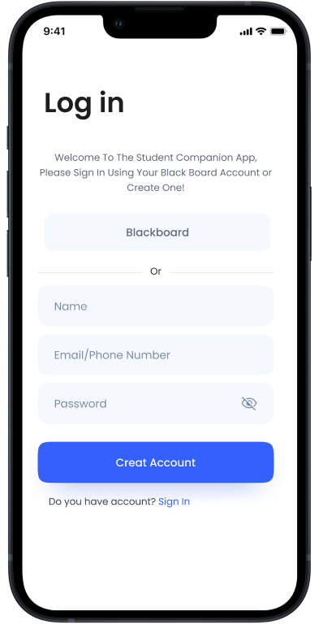
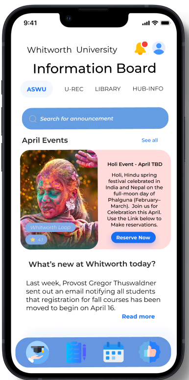
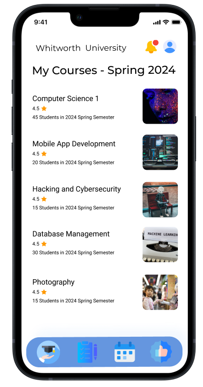
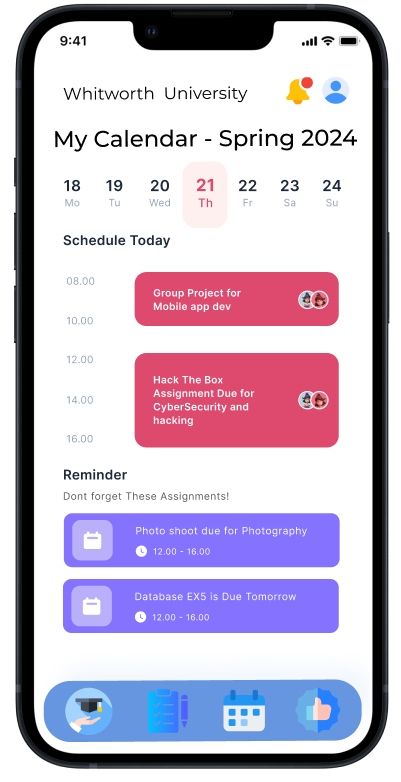

CS375-1 APP1: User Interface Design
====================================

# Instructions:
* Each group must create screen mock-ups drawings for all the features described in the functional specification.
* Include each major screen that the app will display
* e.g. Splash screen, settings screen, data screen, etc...
* Above each screen describe the purpose of that screen and how the user will interact with it.
* Read about the principles of Material design https://material.io/design/ when designing your interface. You don't have to have a perfect first interface design, but head in the right direction!

## Mock Up Design for Student Companion App

This is the log-in page student will be greeted with upon downloading the application. There are 2 ways to register, using personal information or blackboard. Each sign in will require Whitworth Integration upon signing up. 

Upon signing up, students will be greeted with Information board where they will be greeted with event information and campus news that are divided into four departments. The four departments are ASWU, U-REC, Library and HUB-INFO. Each of these have events that are displayed with direct link to register and news that are shown right below it.

On top right corner, there is bell Icon and Profile Pic Icon. When you press the bell icon, all the user notification will be located there including due dates. If you press the profile icon, you will be able to see all user information.

This screen is the first of four buttons that are displayed on the bottom side of the screen. This will have all course informations that you have registered for the term including its student rated ratings, number of students registered. Upon Pressing the course, all of the finer details of the course will be displayed.

This screen is the 3rd screen of four buttons that are displayed on the bottom side of the screen. It will display the current date, assignment due on that day and the day after that. Upon pressing each day, you will be able to see what assignments are due on each one of them.

This screen should display all the personal information of the student that can be edited upon clicking.

Notes: 

Pages to Add - Make To-Do page, Recommendation page, Bell Icon page and details tab on each courses.